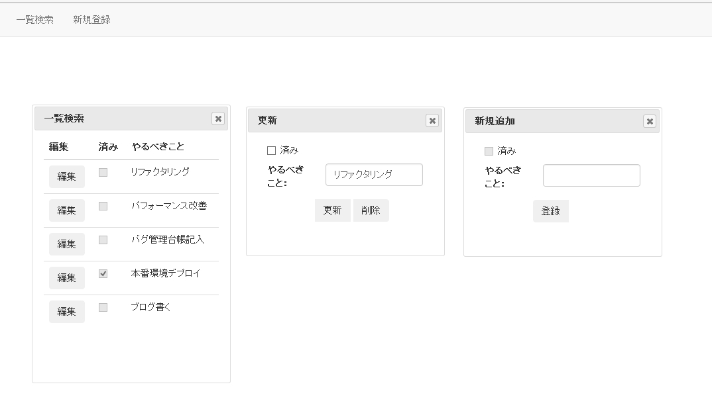

Angular-Todo-Sample
===============

こちらはAngularを使ったTodoアプリのサンプルになります。

## 完成イメージ

完成イメージは以下のようになっています。  

## 機能

+ Todoの検索
	+ ナビゲーションから『一覧検索』のボタンを押します。
+ Todoの登録
	+ ナビゲーションから『新規登録』のボタンを押します。
	+ やるべきことを記入して、『登録』ボタンを押します。
+ Todoの修正
	+ ナビゲーションから『一覧検索』のボタンを押します。
	+ 表示された一覧から編集したTodoを選択して、『編集』のボタンを押します。
	+ 内容を編集して『更新』のボタンを押します 
+ Todoの削除
	+ ナビゲーションから『一覧検索』のボタンを押します。
	+ 表示された一覧から編集したTodoを選択して、『編集』のボタンを押します。
	+ 『削除』のボタンを押します。
+ 基本的にすべてインメモリのため、画面を閉じた時点でデータは消えます。

## 使用した技術

+ ASP.NET Core
	+ APIとWebともに、ASP.NET Core上で動かしています。
	+ C#
+ Angular1.x
+ BootStrap
+ JQuery UI
+ TypeScript

## 著者

+ dexia2
	+ twitter
		+ https://twitter.com/dexia2
	+ ブログ
		+ http://howitworks.hatenablog.jp/